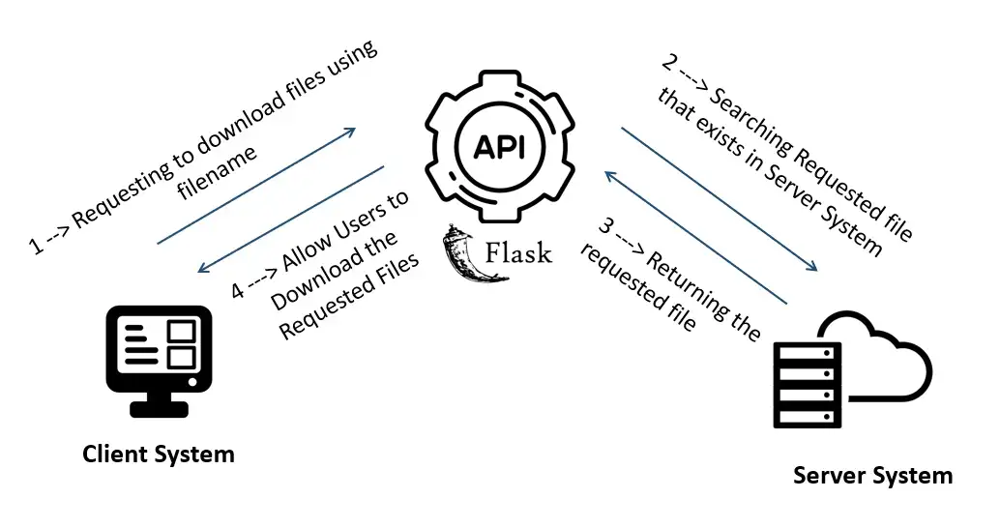

# Flask Server REST API for File Upload




This repository contains a Flask server implementation for a REST API that allows file uploads.

## Description

The Flask server provides endpoints for uploading files via HTTP requests. It is a simple and efficient way to handle file uploads in web applications.

## Installation

1. Clone the repository:

```bash
git clone <repository-url>
```

2. Install dependencies:

```bash
pip install Flask
```

## Usage

1. Start the Flask server:

```bash
python app.py
```

2. Make HTTP requests to the provided endpoints for file uploads.

## Endpoints

- `/upload` - POST endpoint for uploading files.

## Contribution

Contributions to this project are welcome. Feel free to open issues or submit pull requests to improve the functionality or documentation.
